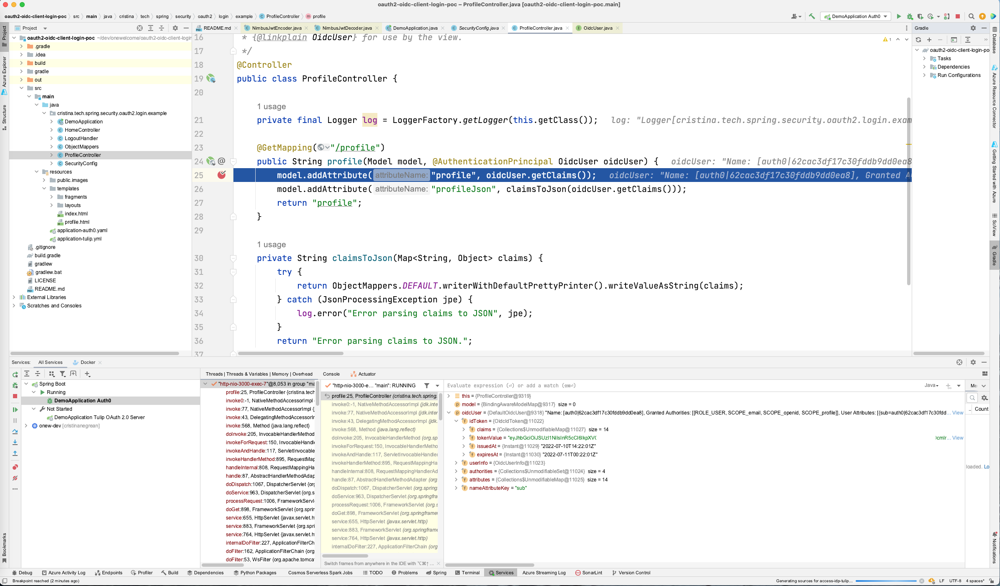
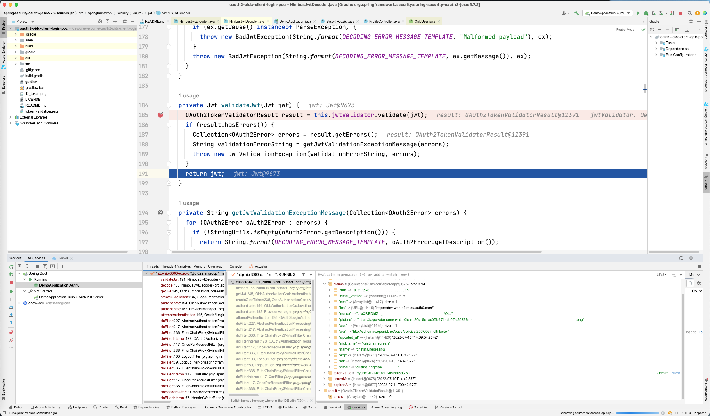
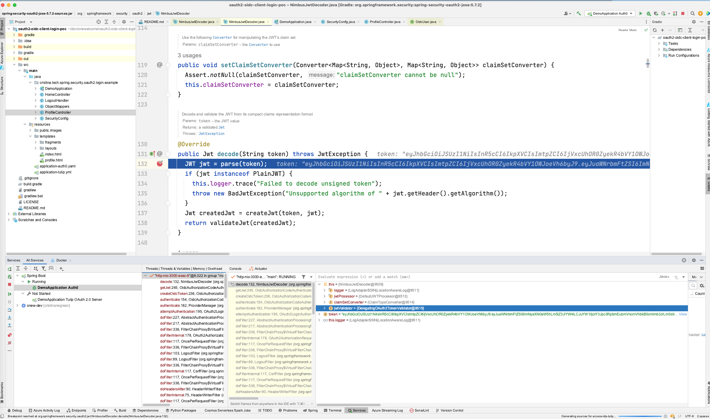

# Spring Boot 2 Login - MVC

This sample demonstrates [flow](https://auth0.com/docs/get-started/authentication-and-authorization-flow/authorization-code-flow)

- Adding authentication with OAuth 2.0 Authorization Server/Auth0 to a Spring Boot 2 MVC application
- Accessing profile information of the authenticated user
- Only allowing authenticated users to access certain resources: OAuth 2.0 protected resource concept

## Pre-requisites

* Java 17

### Callback URL for debugging

* http://localhost:8080/admin/login/oauth2/code/custom

See [here](https://docs.spring.io/spring-security/site/docs/5.2.12.RELEASE/reference/html/oauth2.html#oauth2login-sample-redirect-uri) more details.

### Running the sample

Open a terminal, go to the project root directory and run the following command:

Linux or MacOS:

```bash
./gradlew bootRun
```

Or even use IntelliJ IDEA to put break point in `NimbusJwtDecoder` and use `Services` tab to run Spring Boot `DemoApplication` in `debug` mode.

The application will be accessible at http://localhost:8080/admin. The whole authentication flow starts on `Login` button. Once authenticated, 
you will get access to protected resource `Profile` page.

## License

This project is licensed under the MIT license. See the [LICENSE](LICENSE) file for more info.

## Concepts

`Auth0` and `Authentik` are Identity Provider platforms (IdPs) to add sophisticated authentication and authorization to your applications. 
Centralize and manage users from multiple identity providers and give them branded, seamless signup and login experiences.

The `OAuth 2.0` protocol controls authorization to access a protected resource, like: your web app, native app, or API service, through:
* `access token`: the token issued by the authorization server in exchange for the grant (authorization granted to the client by the user/resource owner)
* `refresh token`: an optional token that is exchanged for a new access token, if the access token has expired

`OAuth 2.0` roles:
* `Resource Owner`: Entity that can grant access to a protected resource. Typically, this is the end-user.
* `Client`: Spring Boot web app requesting access to a protected resource: `/profile` on behalf of the `Resource Owner`.
* `Resource Server`: Server hosting the protected resources. This is the API `/profile` we want to access.
* `Authorization Server`: Server that authenticates the `Resource Owner` and issues `Access and ID Tokens` after getting proper authorization. In this case: `Auth0` or `Tulip`.
* `User Agent`: Agent used by the `Resource Owner` to interact with the `Client`, i.e. web browser.

The `OpenID Connect (OIDC)` protocol is built on the `OAuth 2.0` protocol and helps authenticate users and convey information about them.
It's also more opinionated than plain OAuth 2.0, for example in its scope definitions.

The `authorization server` also acts as:
* an OAuth 2.0 token mitigating engine (has a unique issuer URI and its own signing key for tokens)
* OpenID Connect Provider, which means you can request `ID tokens` in addition to `access tokens` 





